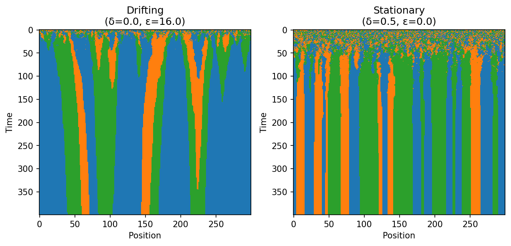
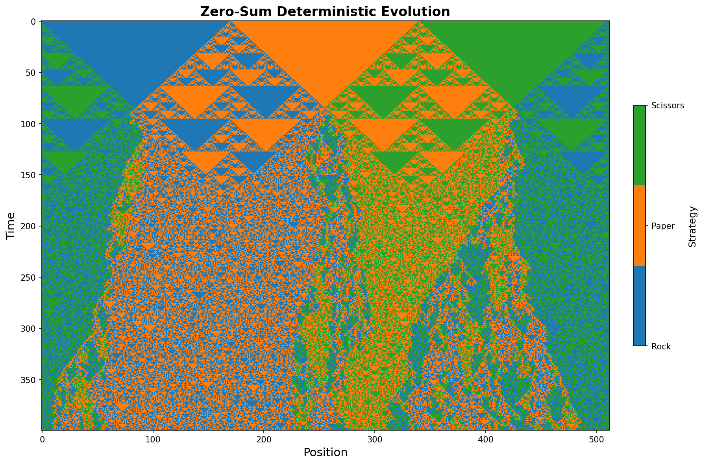
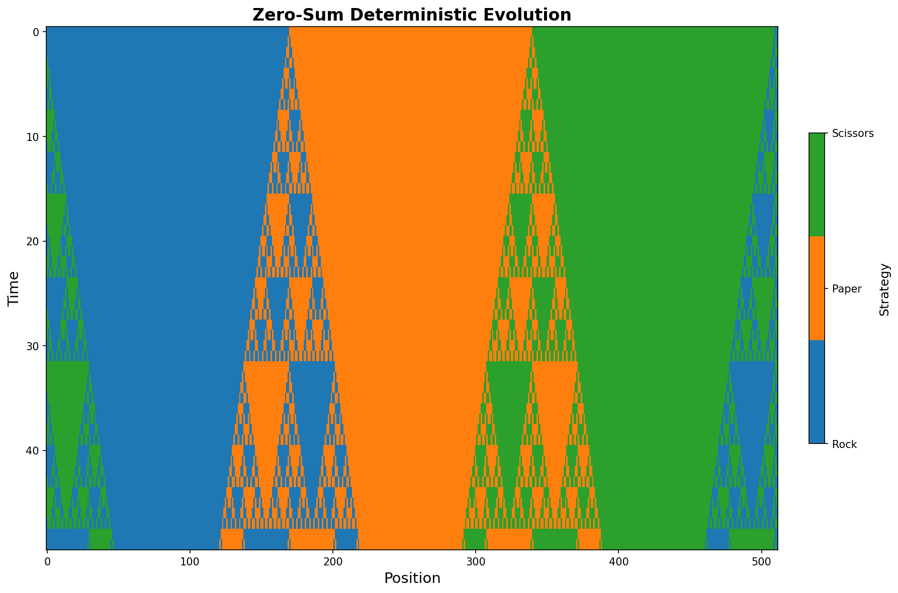

# Game Theory Simulation

A JAX-accelerated implementation of wealth-mediated thermodynamic strategy evolution for reproducing Figure 1 from:

**"Community Formation in Wealth-Mediated Thermodynamic Strategy Evolution"**  
*Connor Olson, Andrew Belmonte, Christopher Griffin (2022)*

## Setup Environment

```bash
conda env create -f environment.yml
```

## Usage

To run everything this repo has to offer, including:
- The two evolutions feature in figure 1
- Comparison graphs
- Analysis graphs including shannon entropy
You should submit this job:
```bash
sbatch scripts/run_figure1_batch.sh
```

In order to run a game with your chosen parameters submit:
```bash
sbatch --export=DELTA=0.5,EPSILON=0 scripts/run_simulation.sh
```

There are also presets available:
```bash
sbatch --export=PRESET=original_stationary scripts/run_simulation.sh
sbatch --export=PRESET=original_drifting scripts/run_simulation.sh
```

If you do not have SLURM, try:

```bash
# Stationary communities (δ=0.5, ε=0)
python main.py --delta 0.5 --epsilon 0

# Drifting communities (δ=0, ε=16)  
python main.py --delta 0 --epsilon 16

# Custom parameters
python main.py --delta 0.3 --epsilon 0.8 --vertices 500 --time_steps 600

# Presets
python main.py --preset original_stationary
python main.py --preset original_drifting
```

## Output Files

### Plots
- `evolution_d{δ}_e{ε}.png`: Main evolution plot (Figure 1 style)
- `analysis_d{δ}_e{ε}.png`: Community analysis plots
- `comparison_plot.png`: Multi-parameter comparison
- `figure_1_reproduction.png`: Side-by-side stationary/drifting

### Data Files (if --save_data used)
- `simulation_d{δ}_e{ε}_{timestamp}.npz`: Raw simulation data
- `parameters_d{δ}_e{ε}_{timestamp}.json`: Parameters and metadata
- `summary_d{δ}_e{ε}.txt`: Summary statistics

## Results 

Here is the recreation of figure 1 by this code:

Note: There is a [figure_1_reproduction.png](./plots/figure_1_reproduction.png) that has a color bar and a title, but it currently is not formatted well.

Here are analysis plots of different evolutions:  
Analysis of the δ=0, ε=16 evolution:

Analysis of the δ=0.5, ε=0 evolution:


## References

Olson, C., Belmonte, A., & Griffin, C. (2022). Community Formation in Wealth-Mediated Thermodynamic Strategy Evolution. *arXiv preprint arXiv:2206.13160*.

# Zero-sum games

Extending this work, Dr. Jackson Henry has requested I explore the idea of zero-sum payouts, which basically means when you lose, you decrement the bank by the same amount you increment the bank when you win, getting nothing for a tie. 

To explore this idea I implemented the ability to run zero sum games by submitting:
```bash
# Zero-sum simulation
sbatch --export=PRESET=zero_sum_512 scripts/run_simulation.sh

# Custom parameters
sbatch --export=PAYOFF_SCHEME=zero_sum,VERTICES=512,INITIAL_PATTERN=striped,INITIAL_BANK_VALUE=-1000,time_steps=400 scripts/run_simulation.sh
```
You can also specify `--stripe_size`, the default simply splits the ring into three (ex. 512 vertices -> 170 rock, 170 paper, 170 scissors, then 2 more rock).

Along with this `INITIAL_PATTERN` can be either random or striped, defaulting to striped.

The default for `INITIAL_BANK_VALUE` is zero.

Note, right now every zero sum game uses deterministic selection, which basically means the agent decides its next method based on it's adjacent agent's current strategy and bank value. In the event of a tie the it will choose it's method based on a priority of rock->paper->scissors (ex. rock tie anything = rock, paper tie scissors = paper).
If you run a wealth-mediated game it automatically chooses the Boltzmann selection described in the paper.

## Results

With the preset, which is three equal stripes, -1000 initial bank value, (-1,0,1) reward scheme, and 400 time steps, it results in this graph:


I also ran the same simulation but just 50 time steps:


And I ran the same simulation but with 6 vertices (agents) and 10 time steps:


## Analysis

Note that this is after the changed to visibilty, so each agent can only see the agent's bank values next to it.

This is very pretty, it reminds me of fractal borders and it reminds Dr Jackson Henry of [rule 30](https://mathworld.wolfram.com/Rule30.html). 

Note: Also functional in the code is the ability to use an average to determine the next result, since for example |R=2|P=4|R=2| previously from the Paper agent's perspective rock is a better choice, but now it basically adds up the rock agent's banks and divides by the amount of rock agents, gets 2 and chooses to stay as paper. This results in a bit of a weird graph that I am still workshopping.
